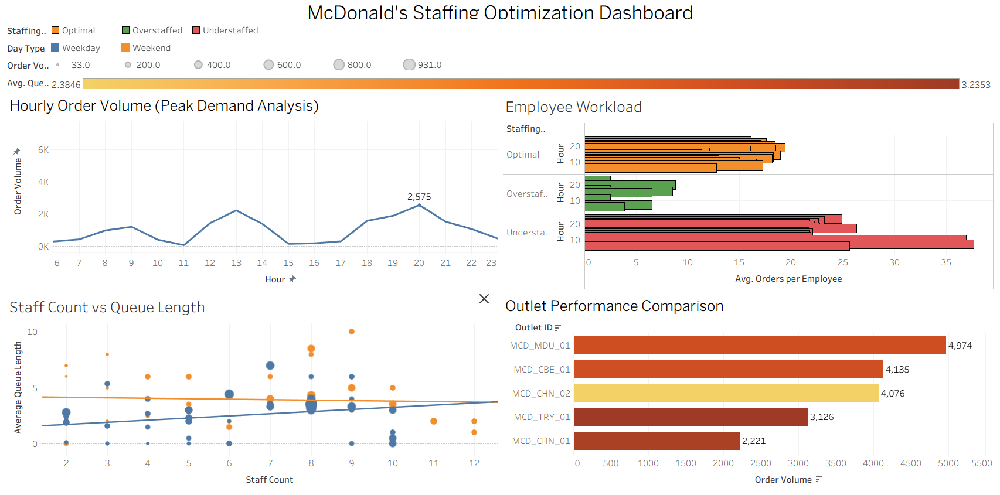

# 🍔 McDonald's Staffing Demand Prediction & Optimization using Random Forest

<p align="center">
  
  
  
  
</p>

## 📌 Project Overview

Efficient workforce planning is one of the biggest operational challenges in the Quick Service Restaurant (QSR) industry. Customer demand changes significantly throughout the day, making it difficult for restaurant managers to schedule the right number of employees.

- **Too few staff** → Long queues, delayed service, employee overload.
- **Too many staff** → Higher labor costs and reduced workforce utilization.

This project builds a **data-driven staffing optimization solution** for McDonald's using **Python, Random Forest, and Tableau**. It analyzes restaurant operational data, identifies peak demand periods, predicts staffing requirements, and provides actionable recommendations through an interactive dashboard.

---

# 📊 Dashboard Preview

<p align="center">
  
</p>

The dashboard combines operational analytics into a single view, enabling managers to quickly identify peak demand hours, workload distribution, staffing efficiency, and outlet performance.

---

# 🚨 Problem Statement

Restaurant managers often rely on fixed schedules or manual estimation while assigning employees.

However, customer demand changes based on:

- Time of day
- Weekdays vs Weekends
- Holiday periods
- Outlet performance
- Queue length
- Order volume

Without data-driven planning, restaurants experience:

- Long customer waiting times
- Employee burnout
- Higher labor costs
- Poor workforce utilization
- Inconsistent service quality

The objective is to determine **when additional staff should be added** while avoiding unnecessary staffing during low-demand periods.

---

# 🎯 Objectives

This project aims to:

- Clean and validate restaurant operational data.
- Perform Exploratory Data Analysis (EDA).
- Identify peak demand periods.
- Calculate Orders per Employee.
- Detect understaffed and overstaffed time periods.
- Compare multiple restaurant outlets.
- Train a Random Forest model for staffing prediction.
- Build an interactive Tableau dashboard.
- Generate practical staffing recommendations.

---

# 📂 Dataset

A realistic mock dataset containing **200 restaurant records** was created for this project.

After cleaning and validation, the dataset retains **100+ valid records** for analysis.

### Dataset Features

| Feature | Description |
|----------|-------------|
| Date | Order date |
| Outlet_ID | Restaurant branch |
| Hour | Operating hour |
| Order_Volume | Number of customer orders |
| Average_Preparation_Time | Average food preparation time |
| Queue_Length | Customers waiting |
| Staff_Count | Employees working |
| Day_Type | Weekday / Weekend |
| Holiday | Holiday indicator |

---

# 🧹 Data Preprocessing

Before training the model, the dataset was cleaned using Python.

### Cleaning Steps

- Removed duplicate records.
- Handled missing values.
- Corrected data types.
- Standardized categorical values.
- Validated numerical ranges.

### Feature Engineering

Additional business metrics were created:

- Orders per Employee
- Staffing Status
- Peak Demand Indicators

These engineered features improve both analysis and prediction.

---

# ⚙️ Technology Stack

| Category | Technology |
|----------|------------|
| Programming | Python |
| Notebook | Jupyter Notebook |
| Data Analysis | Pandas, NumPy |
| Machine Learning | Scikit-learn |
| Algorithm | Random Forest |
| Dashboard | Tableau Public |
| Version Control | Git & GitHub |

---

# 🔄 Project Workflow

```text
Raw Restaurant Dataset
          │
          ▼
Data Cleaning
          │
          ▼
Feature Engineering
          │
          ▼
Exploratory Data Analysis
          │
          ▼
Random Forest Training
          │
          ▼
Model Evaluation
          │
          ▼
Tableau Dashboard
          │
          ▼
Business Recommendations
```

---

# 📈 Exploratory Data Analysis

The cleaned dataset was analyzed to understand customer demand and workforce performance.

Four Tableau visualizations were created.

---

## 1️⃣ Hourly Order Volume (Peak Demand Analysis)

**Purpose**

Identify customer demand throughout the day.

**Observation**

- Lunch demand rises significantly.
- Evening hours experience the highest order volume.
- 8 PM becomes the busiest hour.

**Business Value**

Managers can schedule additional employees before demand spikes.

---

## 2️⃣ Employee Workload Analysis

**Purpose**

Measure employee productivity using Orders per Employee.

**Staffing Categories**

- Optimal
- Understaffed
- Overstaffed

**Business Value**

Shows where employees are overloaded and where staffing can be reduced.

---

## 3️⃣ Staff Count vs Queue Length

**Purpose**

Understand how staffing affects customer waiting time.

**Observation**

- Queue length generally decreases as staffing improves.
- Peak hours still require proactive staffing.

**Business Value**

Helps determine whether additional employees actually improve service.

---

## 4️⃣ Outlet Performance Comparison

**Purpose**

Compare restaurant branches.

**Observation**

- MCD_MDU_01 records the highest order volume.
- Performance varies across outlets.

**Business Value**

Supports outlet-specific staffing decisions.

---

# 🤖 Machine Learning Model

## Algorithm Used

### Random Forest Regressor

Random Forest was selected because it:

- Handles nonlinear relationships.
- Works well with operational data.
- Reduces overfitting.
- Provides stable predictions.

---

## Model Training

### Input Features

- Hour
- Order Volume
- Queue Length
- Staff Count
- Day Type
- Holiday

### Target

Restaurant staffing demand prediction.

The model was trained using Scikit-learn after preprocessing the dataset.

The trained model is stored inside:

```text
models/random_forest_model.pkl
```

---

# 📊 Model Evaluation

The Random Forest model was evaluated using standard regression metrics.

| Metric | Purpose |
|---------|----------|
| MAE | Average prediction error |
| RMSE | Measures larger prediction errors |
| R² Score | Overall prediction accuracy |

The evaluation summary is stored in:

```text
outputs/model_metrics.txt
```

Feature importance analysis is available in:

```text
outputs/feature_importance.csv
```

---

# 🔍 Feature Importance

The Random Forest model identifies which variables contribute most to staffing prediction.

Important contributors include:

- Order Volume
- Queue Length
- Hour of Day
- Staff Count
- Day Type

These insights help managers focus on the variables that most influence staffing demand.

---

# 💡 7 Key Business Insights

The analysis produced several practical findings.

### 1. Evening Rush is the Biggest Demand Period

8 PM records the highest customer demand.

### 2. Lunch Hours Require Additional Staffing

1 PM consistently experiences high order volume.

### 3. Understaffed Periods Increase Employee Workload

Orders per Employee become highest during understaffed hours.

### 4. Weekends Show Different Demand Patterns

Weekend traffic differs from weekday operations.

### 5. Higher Staffing Does Not Always Eliminate Queues

Some peak hours still experience waiting despite additional employees.

### 6. Outlet Performance Varies

MCD_MDU_01 processes the highest order volume among all outlets.

### 7. Dynamic Scheduling is More Effective

Staffing should change by hour instead of remaining fixed throughout the day.

---

# 📋 Practical Action Plan

Based on the analysis, restaurant managers can implement the following staffing strategy.

## Immediate Actions

| Time | Recommendation |
|------|---------------|
| 12 PM–2 PM | Increase staffing |
| 6 PM–9 PM | Increase staffing |
| Low-demand hours | Reduce excess staff |

## Operational Improvements

- Schedule extra employees before evening rush.
- Reduce staffing during consistently quiet hours.
- Monitor queue length alongside staffing.
- Create separate schedules for weekdays and weekends.
- Review outlet-specific staffing every week.

## Long-Term Recommendations

- Implement real-time staffing prediction.
- Use historical demand for automatic shift scheduling.
- Build live dashboards for managers.
- Continuously retrain the prediction model with new data.

---

# 📊 Project Outputs

### Dataset Outputs

- Cleaned Dataset
- Summary Reports

### Machine Learning Outputs

- Trained Random Forest Model
- Feature Importance Report
- Model Evaluation Metrics

### Tableau Outputs

- Interactive Dashboard
- Business Visualizations

### Business Reports

- Staffing Recommendations
- Operational Insights
- Demand Summaries

---

# 📁 Project Structure

```text
mcd-staffing-demand-prediction/
│
├── data/
│   ├── restaurant_mock_dataset.csv
│   └── restaurant_cleaned.csv
│
├── models/
│   └── random_forest_model.pkl
│
├── notebooks/
│
├── outputs/
│   ├── charts/
│   ├── action_plan.txt
│   ├── correlation.txt
│   ├── day_type_summary.csv
│   ├── feature_importance.csv
│   ├── holiday_summary.csv
│   ├── hourly_orders_summary.csv
│   ├── insights.txt
│   ├── model_metrics.txt
│   ├── outlet_summary.csv
│   ├── recommendation_summary.csv
│   └── workload_summary.csv
│
├── tableau/
│   ├── Dashboard.png
│   └── McDonalds_Staffing_Optimization_Dashboard.twb
│
├── Restaurant_Staffing_Analysis.ipynb
├── requirements.txt
└── README.md
```

---

# 🚀 Installation

Clone the repository.

```bash
git clone https://github.com/Rukshana-S/mcd-staffing-demand-prediction.git
```

Navigate into the project.

```bash
cd mcd-staffing-demand-prediction
```

Install dependencies.

```bash
pip install -r requirements.txt
```

Launch Jupyter Notebook.

```bash
jupyter notebook
```

Open:

- `Restaurant_Staffing_Analysis.ipynb`

For dashboard exploration, open:

```text
tableau/McDonalds_Staffing_Optimization_Dashboard.twb
```

---

# 📈 Future Enhancements

- Real-time staffing prediction.
- Automated shift scheduling.
- Multi-outlet optimization.
- Cloud deployment.
- Live restaurant analytics dashboard.

---

# 👩‍💻 Author

**Rukshana S**

B.E. Computer Science and Engineering

Sri Eshwar College of Engineering

GitHub: **Rukshana-S**

---

# 🏁 Conclusion

This project demonstrates how **Machine Learning and Business Intelligence** can improve workforce planning in quick-service restaurants. By combining **Random Forest prediction** with an **interactive Tableau dashboard**, the solution helps restaurant managers identify peak demand hours, balance employee workload, reduce waiting times, optimize staffing costs, and make informed scheduling decisions.